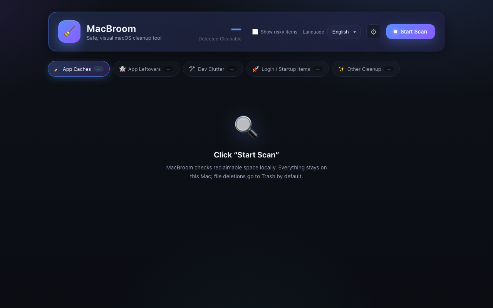

<div align="center">

# 🧹 MacBroom

**开源 macOS 清理工具 · 安全、可视化地释放磁盘空间**
<br>**Open-source macOS cleaner — free up disk space safely**

一个 **CleanMyMac 的开源替代品**：扫描可释放空间 → 按软件分组 → 勾选一键清理。所有删除默认移入「废纸篓」，可一键还原。纯本地、零依赖、不联网。

> An **open-source CleanMyMac alternative**, local-only and Trash-by-default. **Full English docs: [README.md](./README.md).**

[English](./README.md) · 简体中文

[](https://github.com/mythkiven/MacBroom/actions/workflows/ci.yml)
[](./LICENSE)
[](https://www.python.org/)

[](./CONTRIBUTING.md)

</div>



---

## ✨ 特性

- **纯本地 · 零依赖**：只用 Python 3 标准库，不联网、不上传任何数据。
- **安全优先**：默认把文件移入「废纸篓」而非 `rm`，误删可在废纸篓还原；系统关键路径（`/System`、钥匙串、SSH 密钥等）硬性拒绝删除。
- **风险分级**：每一项标注 `安全 / 中等 / 高风险` 三档。安全项可放心删，高风险项（个人数据、不可逆操作）默认**隐藏**，需在右上角勾选「显示高风险项」才出现。
- **残留可解释**：每条疑似卸载残留都会说明**判定理由**（bundle id 无对应已安装 App），并可**展开查看实际文件**后再决定删不删。
- **删除前确认（dry-run）**：清理前弹窗逐项列出路径与判定理由、总项数与预计释放空间，超过 10 GB 或含高风险项会额外警告，确认后才执行。
- **排序与展开**：结果可按大小 / 名称排序，分组与条目都能展开看清里面是什么。
- **操作审计日志**：每次扫描与删除都写入 `~/Library/Logs/MacBroom/macbroom.log`，可事后追溯工具到底动了什么。
- **按软件维度展示**：缓存等按 App 分组，看得清、删得明白；重扫后保留你已勾选的项。
- **可定制**：每个扫描类别可单独开关；支持「排除清单」把误判项永久排除；长扫描可随时取消。
- **iCloud 友好**：自动识别 iCloud 同步目录，避免清理引发跨设备同步异常。
- **尊重 `CACHEDIR.TAG`**：识别标准缓存标记，准确判定哪些目录是缓存。
- **覆盖主流应用缓存**：除浏览器 / 开发者缓存外，还覆盖 Slack、Discord、VS Code、Microsoft Teams、Spotify、Steam、Telegram、Minecraft 等常见应用。
- **登录项体检**：揪出指向「已删除程序」的孤儿开机启动项（就是系统设置里报错的那些「后台项」），一键清掉。
- **CLI / 脚本友好**：`macbroom scan --json` 直接在终端出报告，方便接入自动化与 CI。
- **`macbroom doctor`**：扫描前预检 Python、完全磁盘访问、日志目录与端口是否就绪。
- **权限不足不强删**：删不掉的项会列出来，并给出可复制的终端命令，由你自行执行。
- **漂亮的 Web UI**：分组折叠、组级全选、实时统计可释放空间。

## 🔍 检测的内容

| 分类 | 说明 |
|---|---|
| 🧹 **应用缓存** | 可自动重建的缓存，按软件分组（含 npm/pip/Gradle/CocoaPods/Homebrew 等开发者缓存，及 Chrome/Edge/Brave/Arc/Firefox 浏览器缓存） |
| 👻 **卸载残留** | 已卸载 App 遗留的支持文件、容器、日志、偏好设置（启发式判定，需复核） |
| 🐘 **大文件** | 单个大于 100MB 的文件，定位占空间的视频 / 镜像 / 归档 |
| 🛠️ **开发残留** | iOS/Xcode、Android/Android Studio、HarmonyOS/DevEco Studio 的构建产物、缓存、模拟器与 SDK 临时目录 |
| 🧬 **重复文件** | 内容逐字节相同的文件（大小 → 部分哈希 → 完整 SHA-256 三级收敛），每组保留最新一份 |
| 🚀 **登录项 / 启动项** | 开机自启的 LaunchAgents / LaunchDaemons，重点揪出指向已删除程序的「孤儿」残留项 |
| ✨ **其它可清理项** | 诊断报告、iOS 设备备份、Homebrew 残留、Docker 镜像、Time Machine 本地快照、散落的 `node_modules`、邮件附件缓存、旧 Downloads |

## 💡 为什么选 MacBroom？—— 从竞品的真实事故里长出来的

我们通读了**主流开源 Mac 清理工具的数百条 issue**，专门设计 MacBroom 来**避开它们已经发生过、被用户报告过的最痛事故**：

| 别的清理工具报告过的真实事故 | MacBroom 如何从设计上规避 |
|---|---|
| 把用户**整个 Chrome 配置删光**（登录态、书签全没） | 只精确清理 `Default/Cache`、`Code Cache`，**绝不**碰配置目录 |
| 按名字误判，把 **Apple Notes / Claude Code CLI 当残留删掉** | 残留判定用 **bundle id 精确匹配**；每条都给出判定理由，并可展开文件清单复核后再删 |
| 把 **shell 命令历史**（`~/.zsh_history`）当垃圾删掉 | 根本不扫、不碰 shell 历史 |
| 清理**搞坏 iCloud 同步**（桌面 / 文档） | **自动识别 iCloud 同步目录**，标为高风险并默认隐藏 |
| 卸载时**误判无关文件**（`~/Public`、打印机配置、别的 App 数据） | bundle-id 匹配 + 风险分级 + 可持久化的**排除清单**永久跳过误判项 |
| **空间数字不准 / 出现负数**（稀疏镜像按逻辑大小计） | 用 `st_blocks` 算真实占用，稀疏的 VM / 磁盘镜像不会被虚报 |
| **界面没翻译 / 翻译错乱** | 中英双语**母语级质量**，不是机翻字符串 |
| **清理模拟器时报错** | iOS/Xcode 模拟器通过官方 `xcrun simctl` 接口清理，不靠盲删路径 |
| **长扫描把程序卡死**，还没法中断 | 每次扫描都**可随时取消** |
| 卸载后系统设置里残留报错的**孤儿登录项** | 专门的**登录项扫描器**，揪出指向已删除程序的启动项 |

一句话：**别的工具先删了再道歉，MacBroom 从设计上就让"危险"难以发生**——默认进废纸篓、高风险默认隐藏、删除前逐项列清单二次确认、所有操作留审计日志。

## 🚀 使用

### 方式一：免安装直跑（当前即可用，克隆源码）

```bash
git clone https://github.com/mythkiven/MacBroom.git
cd MacBroom
./run.sh
# 或： python -m macbroom
```

### 方式二：pipx / pip 安装

> 将随首个正式版本发布到 PyPI；在此之前请用方式一。

```bash
pipx install macbroom      # 或： pip install macbroom
macbroom                   # 启动并自动打开浏览器
```

浏览器会自动打开 `http://127.0.0.1:37700`。点击「开始扫描」，勾选后点「清理选中项」即可。

可选参数：

```bash
macbroom --port 40000   # 指定端口
macbroom --no-open      # 不自动打开浏览器
```

### 方式三：命令行报告（无界面 / 脚本友好）

不想开界面、想接入脚本或 CI？直接在终端出报告：

```bash
macbroom doctor                          # 预检：Python、完全磁盘访问、端口、日志目录
macbroom scan                            # 终端打印各分类汇总与可释放总量
macbroom scan --json                     # 输出 JSON，便于脚本 / CI 消费
macbroom scan --lang en                  # 英文输出
macbroom scan --category caches,login_items   # 只扫描指定分类
```

## 🛡️ 安全说明

- **默认可还原**：普通文件类清理走 macOS 废纸篓，删错了能从废纸篓「放回原处」。
- **命令类项**（标「命令」）：如清理无效模拟器、删除多余运行时、`brew cleanup`、`docker prune` 等，由工具内部生成的固定命令直接执行，不接受任意输入。
- **手动类项**（标「手动 / 需 sudo」）：涉及管理员权限或有风险的操作，工具**不会**替你执行，只给出命令让你自行判断。
- **接口防滥用**：服务仅监听 `127.0.0.1`，校验 `Host` 头防 DNS rebinding；删除接口要求携带每次启动随机生成的 CSRF token（外部网页因 CORS 预检失败无法调用），且只接受「本次扫描产出过的条目」，不能被当作任意路径删除后端。
- **不做不可逆的一键操作**：不提供「一键清空废纸篓」这类不可恢复按钮。

## 🖥️ 系统兼容

- 仅依赖 Python 3 标准库，建议 **Python 3.9+**（用到 `dict[str, ...]` 等 PEP 585 注解）。
- 在 macOS 12 (Monterey) ~ 15 (Sequoia) / 26 (Tahoe) 上工作；旧系统上若某条路径或命令（如 `simctl runtime`、`tmutil thinlocalsnapshots`）不存在，对应项会自动跳过，不影响其它分类。

## ⚠️ 免责声明

清理工具会删除文件。尽管 MacBroom 默认走废纸篓并对系统路径设了保护，**清理前请阅读每一项的说明**，对「大文件」「卸载残留」「设备备份」这类标橙的项尤其谨慎。使用风险自负。

## 🧩 架构

```
macbroom/
  cli.py             入口（参数解析、启动服务；console 命令 macbroom）
  __main__.py        支持 python -m macbroom
  core/
    model.py         ScanItem / Category 数据模型（含风险等级）
    fsutil.py        体量计算、安全遍历、受保护路径
    trash.py         安全删除（废纸篓）与安全命令执行
    audit.py         操作审计日志（可用 MACBROOM_LOG_DIR 覆盖目录）
    server.py        本地 HTTP 服务 + 扫描/删除 API（Host 校验 + CSRF）
  scanners/
    __init__.py      扫描器注册表
    appindex.py      已安装 App 索引（bundle id ↔ 名称）
    caches.py        应用 / 开发者 / 浏览器缓存
    app_leftovers.py 卸载残留
    large_files.py   大文件
    ios_dev.py       iOS / Android / HarmonyOS 开发残留
    duplicates.py    重复文件（三级哈希收敛）
    login_items.py   登录项 / 孤儿 LaunchAgents / LaunchDaemons
    system_extras.py 备份 / Docker / TM 快照 / node_modules / 邮件附件 / 旧下载
  web/               单页前端（原生 HTML/CSS/JS，无框架）
```

新增一个扫描器：在 `macbroom/scanners/` 下写个模块，暴露 `CATEGORY` 和 `scan()`，再到 `macbroom/scanners/__init__.py` 的 `_MODULES` 登记即可。详见 [CONTRIBUTING.md](./CONTRIBUTING.md)。

## 📄 License

[MIT](./LICENSE)
